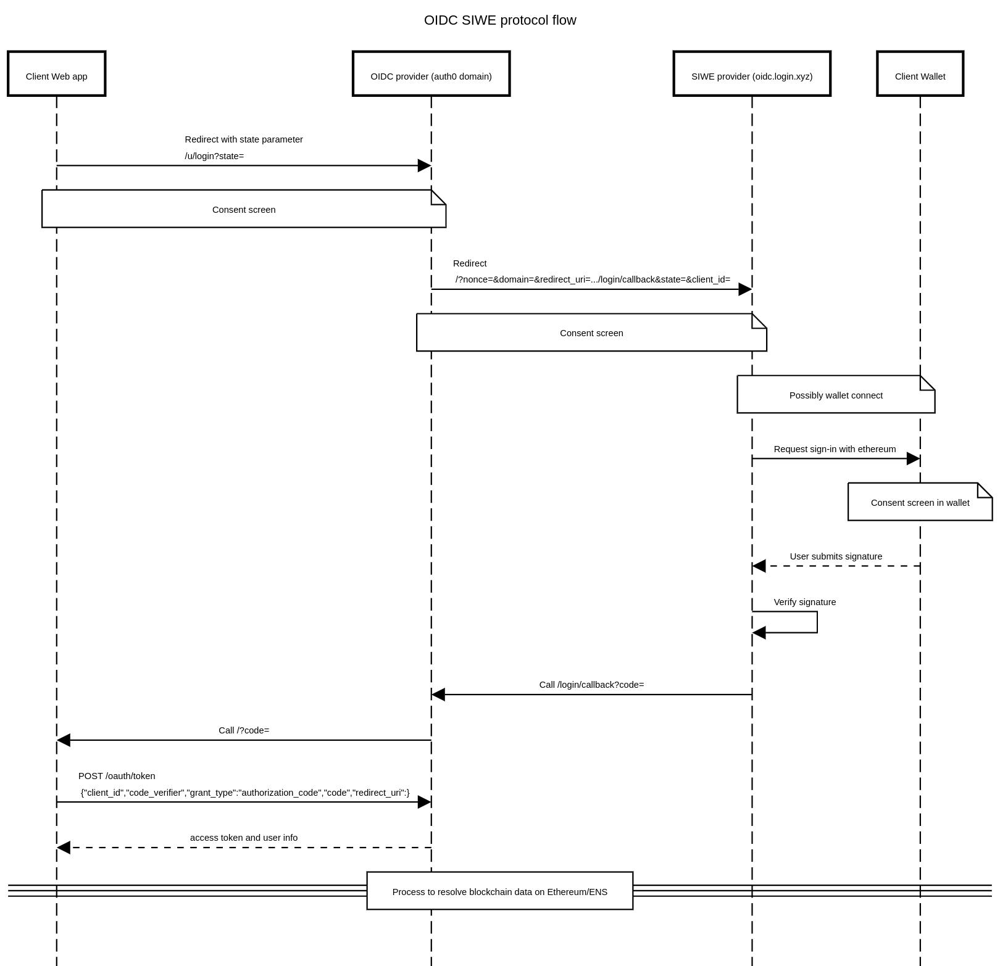

# oidc-siwe-app

Submission for https://amsterdam.ethglobal.com/

An attempt at understanding a bit more the process when using [OpenID Connect](https://openid.net/specs/openid-connect-core-1_0.html) and [SIWE](https://login.xyz)

The submission is two-fold:

- Mainly q protocol flow diagram [Diagram source](./sequence_diagram.txt)
 heavily inspired by the one ine [Auth0 blog post](https://auth0.com/blog/sign-in-with-ethereum-siwe-now-available-on-auth0/)

- An example app in [app](./app) deployed on [cloudflare pages](https://auth0.com/blog/sign-in-with-ethereum-siwe-now-available-on-auth0/)
